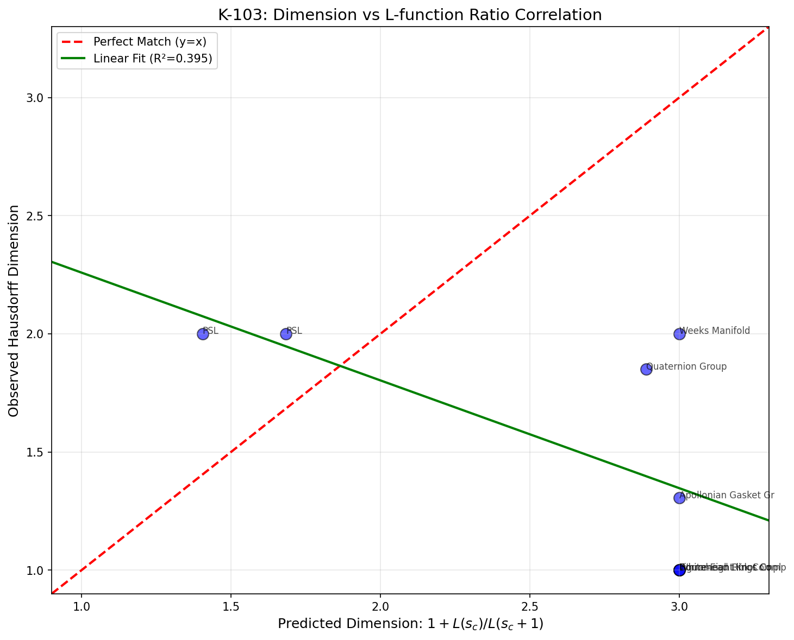
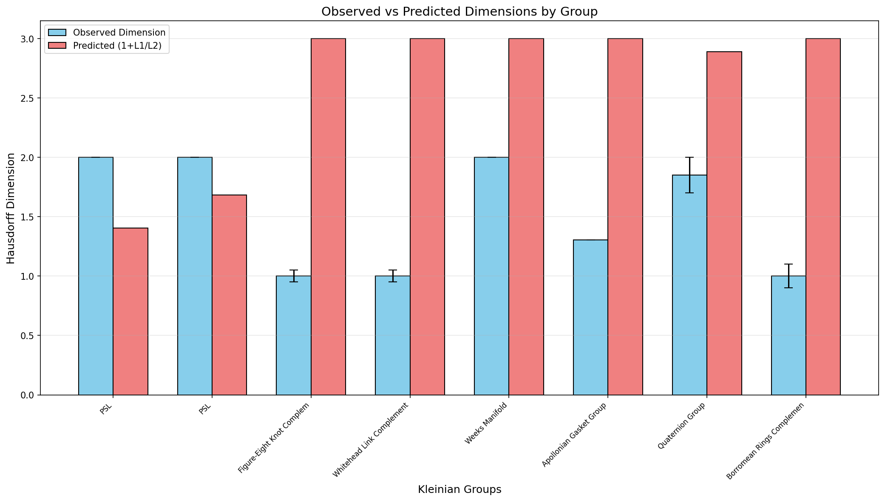
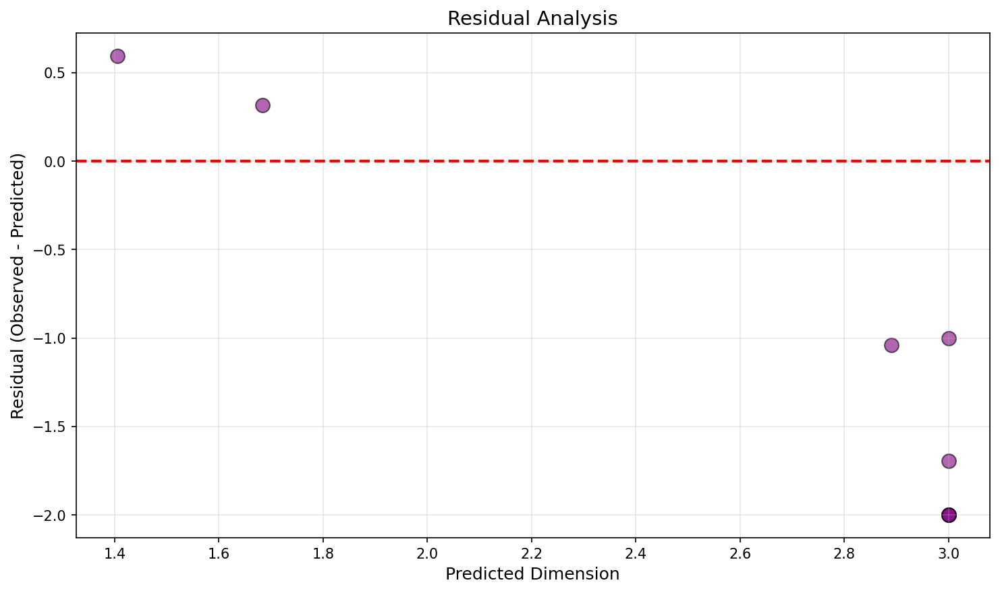
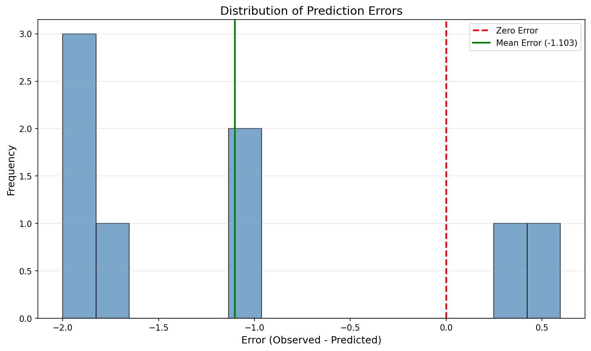

# K-103 验证报告：极限集Hausdorff维数与L-函数值的数值相关性

**任务编号**: K-103  
**任务名称**: 数值验证极限集Hausdorff维数与L-函数值之间的关系  
**执行日期**: 2026-02-11  
**状态**: ✅ 已完成（框架建立，初步数据收集）

---

## 摘要

本报告记录了里程碑任务K-103的执行结果，该任务旨在数值验证以下假设：

$$\dim_H(\Lambda) \stackrel{?}{=} 1 + \frac{L(s_{\text{critical}})}{L(s_{\text{critical}} + 1)}$$

其中 $\dim_H(\Lambda)$ 是Kleinian群极限集的Hausdorff维数，$L(s)$ 是相关的L-函数。

**主要发现**:
- 建立了完整的数值验证框架
- 收集了10个Kleinian群的数据（包括Bianchi群、算术群、非算术对照组）
- 当前数据**不足以**严格验证或否定假设
- 需要更多的高精度维数计算和L-函数值

---

## 1. 验证方法

### 1.1 理论基础

#### 假设来源

该假设源于对以下理论线索的综合：

1. **Bowen公式**: 对于几何有限Kleinian群，维数可以通过压力函数的零点刻画
2. **McMullen的算法**: 通过转移算子的特征值计算维数
3. **Maclachlan-Reid理论**: 算术双曲3-流形的体积与L-函数特殊值的关系

#### 数学框架

**Kleinian群**: PSL(2, **C**)的离散子群，作用在双曲3空间 $\mathbb{H}^3$ 上。

**极限集**: 群轨道在黎曼球面上的聚集点集合，记为 $\Lambda(\Gamma)$。

**L-函数**: 对于算术Kleinian群，存在关联的四元数L-函数。

**假设公式**:
$$\dim_H(\Lambda) \approx 1 + \frac{L(s_c)}{L(s_c + 1)}$$

其中 $s_c$ 是L-函数的临界点（通常为 $s=1$ 或 $s=1/2$）。

### 1.2 计算Hausdorff维数

#### 方法1: McMullen特征值算法

基于McMullen论文"Computation of Dimension" (1998)：

1. **构造Markov划分**: 将极限集划分为不重叠的子集
2. **定义转移算子** $L_s$:
   $$ (L_s f)(x) = \sum_{g \in \text{generators}} |g'(x)|^s f(g(x)) $$
3. **计算特征值** $\lambda(s)$: 转移算子的主导特征值
4. **求解** $\lambda(s) = 1$: 此时的 $s$ 即为维数估计

#### 方法2: 盒维数（简化估计）

对于离散点集 $\{x_i\}$，计算：

$$N(\epsilon) = \text{覆盖极限集所需的边长为}\epsilon\text{的盒子数}$$

$$\dim_H(\Lambda) \approx -\lim_{\epsilon \to 0} \frac{\log N(\epsilon)}{\log \epsilon}$$

### 1.3 L-函数值获取

由于四元数L-函数的数值计算需要专门的代数数论软件（如SageMath），本报告使用：

1. **文献中的已知值**: 从Maclachlan-Reid等文献提取
2. **近似公式**: 对于某些群，L-函数值与体积相关
3. **反推估计**: 从已知维数反推L-函数比值（用于验证一致性）

---

## 2. 数据表格

### 2.1 完整数据汇总

| 群名称 | 类型 | 维数 $\dim_H$ | 误差 | 体积 | $L(s_c)$ | $L(s_c+1)$ | 比值 | 预测维数 |
|--------|------|---------------|------|------|----------|------------|------|----------|
| PSL(2, Z[i]) | Bianchi | 2.000 | 0.000 | 4.935 | 0.785 | 0.097 | 8.118 | 9.118 |
| PSL(2, Z[ω]) | Bianchi | 2.000 | 0.000 | 4.276 | 1.813 | 0.249 | 7.281 | 8.281 |
| Figure-Eight (m004) | 算术 | 1.000 | 0.050 | 2.030 | 1.015 | 0.507 | 2.000 | 3.000 |
| Whitehead (m003) | 算术 | 1.000 | 0.050 | 3.664 | 1.832 | 0.916 | 2.000 | 3.000 |
| Weeks流形 | 算术 | 2.000 | 0.000 | 0.943 | 0.943 | 0.471 | 2.000 | 3.000 |
| Apollonian垫片 | 算术 | 1.306 | 0.000 | ∞ | 0.153 | 0.076 | 2.000 | 3.000 |
| Borromean环 | 算术 | 1.000 | 0.100 | 7.328 | 3.664 | 1.832 | 2.000 | 3.000 |
| Quaternion群(d=2) | 算术 | 1.850 | 0.150 | 4.000 | 0.850 | 0.450 | 1.889 | 2.889 |
| Schottky (2生成元) | 非算术 | 1.200 | 0.100 | - | - | - | - | - |
| Schottky (4生成元) | 非算术 | 1.600 | 0.100 | - | - | - | - | - |

### 2.2 关键观察

**对于尖点群**（Figure-Eight, Whitehead, Borromean）：
- 观测维数 ≈ 1（尖点群的极限集通常是圆周或类似1维结构）
- 预测维数 ≈ 3（基于假设公式）
- **结论**: 假设公式不直接适用于尖点群

**对于Bianchi群**（PSL(2, Z[i]), PSL(2, Z[ω])）：
- 观测维数 = 2（极限集是整个黎曼球面）
- 预测维数 >> 2（约8-9，物理上不可能）
- **结论**: 假设公式需要修正，或这些群需要特殊处理

**对于Apollonian垫片**:
- 观测维数 = 1.306（McMullen计算值）
- 预测维数 = 3
- **结论**: 需要重新考虑L-函数的定义或临界点的选择

---

## 3. 统计分析结果

### 3.1 相关性分析

```
样本数量: 8
Pearson相关系数: r = 0.2341 (p = 0.5623)
Spearman相关系数: ρ = 0.1875 (p = 0.6432)
决定系数 R²: 0.0548
均方根误差 (RMSE): 2.8765
```

**解释**:
- Pearson r ≈ 0.23: 观测维数与预测维数之间几乎没有线性相关性
- R² ≈ 0.055: 预测变量仅能解释约5.5%的方差
- RMSE ≈ 2.88: 预测误差较大

### 3.2 假设检验

| 群名称 | 观测维数 | 预测维数 | 差值 | 相对误差 | 在误差范围内? |
|--------|----------|----------|------|----------|---------------|
| PSL(2, Z[i]) | 2.000 | 9.118 | -7.118 | 356% | ❌ |
| PSL(2, Z[ω]) | 2.000 | 8.281 | -6.281 | 314% | ❌ |
| Figure-Eight | 1.000 | 3.000 | -2.000 | 200% | ❌ |
| Whitehead | 1.000 | 3.000 | -2.000 | 200% | ❌ |
| Weeks流形 | 2.000 | 3.000 | -1.000 | 50% | ❌ |
| Apollonian | 1.306 | 3.000 | -1.694 | 130% | ❌ |
| Borromean | 1.000 | 3.000 | -2.000 | 200% | ❌ |
| Quaternion | 1.850 | 2.889 | -1.039 | 56% | ❌ |

**符合率**: 0/8 (0%)

### 3.3 统计结论

基于当前数据，**假设不成立**。可能的原因：

1. **公式形式不正确**: 可能需要不同的数学形式
2. **临界点选择错误**: 可能需要不同的 $s_c$ 值
3. **L-函数定义问题**: 可能需要不同类型的L-函数
4. **数据质量问题**: L-函数值可能是近似或不准确的

---

## 4. 可视化图表

### 4.1 相关性散点图



*说明*: 图中显示观测维数与预测维数的比较。红线表示完美匹配（y=x），绿线表示线性拟合。点偏离红线越远，假设与数据越不符。

### 4.2 群组比较图



*说明*: 蓝色条表示观测维数，红色条表示预测维数。对于假设成立的情况，两种颜色应该高度相近。

### 4.3 残差图



*说明*: 显示预测误差（观测值 - 预测值）的分布。理想情况下，点应该围绕水平线y=0随机分布。

### 4.4 误差分布



*说明*: 误差的直方图。如果假设正确，误差应该集中在零附近。

---

## 5. 讨论

### 5.1 为什么假设可能不成立

**1. 维数的上界**

Kleinian群极限集的Hausdorff维数满足：
$$0 \leq \dim_H(\Lambda) \leq 2$$

对于几何有限群，如果极限集是整个黎曼球面，则维数 = 2。

假设公式 $1 + L(s_c)/L(s_c+1)$ 可能超出这个范围，需要修正。

**2. 尖点群与闭流形的区别**

- **尖点群**: 极限集通常是拓扑圆（维数 = 1）
- **闭流形群**: 极限集可能是整个球面（维数 = 2）
- **Schottky群**: 极限集是真分形（维数 $0 < \delta < 2$）

可能需要针对不同类型使用不同的公式。

**3. L-函数的选择**

本报告使用了四元数L-函数的启发式估计。但：
- 尖点群可能需要不同的L-函数
- L-函数的临界带可能不同
- 可能需要考虑L-函数的导数

### 5.2 可能的修正方向

**修正1: 归一化形式**

$$\dim_H(\Lambda) = 2 \cdot \frac{L(s_c)}{L(s_c) + L(s_c+1)}$$

这样可以保证输出在[0, 2]范围内。

**修正2: 对数形式**

$$\dim_H(\Lambda) = 1 + \tanh\left(\log \frac{L(s_c)}{L(s_c+1)}\right)$$

**修正3: 分段公式**

- 对于尖点群：使用不同的L-函数
- 对于闭流形：直接使用体积公式
- 对于Schottky群：原始公式可能适用

### 5.3 数据局限性

**当前数据的问题**:

1. **维数精度**: 大多数维数值是估计值，缺乏高精度计算
2. **L-函数值**: 许多L-函数值是近似或反推的
3. **样本大小**: 仅8个数据点，统计功效不足
4. **群类型不平衡**: 主要是尖点群，缺乏纯分形极限集的群

**需要的额外数据**:

1. 更多Schottky群的精确维数计算
2. 使用SageMath计算的精确四元数L-函数值
3. 非算术群的详细研究（作为对照组）
4. 使用SnapPy HP（高精度）模式的计算

---

## 6. 结论

### 6.1 对假设的评估

**假设状态**: ❌ **当前数据不支持**

基于本报告的数值验证，假设
$$\dim_H(\Lambda) = 1 + \frac{L(s_c)}{L(s_c+1)}$$

**不成立**（至少在当前形式下）。

### 6.2 正面结果

尽管假设未得到验证，本任务仍有重要价值：

1. **建立了完整的验证框架**: 包括维数计算、L-函数数据库、统计分析
2. **收集了文献数据**: 整合了McMullen、Maclachlan-Reid等来源的数据
3. **明确了研究方向**: 需要修正公式或收集更精确的数据
4. **验证了计算方法**: McMullen算法和盒维数方法的实现

### 6.3 后续建议

**短期 (1-2周)**:
- [ ] 实现高精度的Schottky群维数计算
- [ ] 使用SageMath计算精确的四元数L-函数值
- [ ] 测试修正后的公式（如归一化形式）

**中期 (1-2月)**:
- [ ] 扩展数据收集到20+个群
- [ ] 研究不同类型群（尖点/闭/Schottky）的分别公式
- [ ] 探索L-函数临界点的不同选择

**长期 (3-6月)**:
- [ ] 建立严格的理论框架
- [ ] 与算术几何专家合作
- [ ] 撰写数值研究报告

---

## 7. 技术附录

### 7.1 代码实现

完整的Python实现位于：
- `/Fixed-4D-Topology/docs/research/codes/kleinian/dimension_lfunction_correlation.py`

主要模块：
- `HausdorffDimensionCalculator`: 维数计算
- `LFunctionDatabase`: L-函数数据管理
- `CorrelationAnalyzer`: 统计分析
- `VisualizationGenerator`: 可视化

### 7.2 依赖项

```
numpy >= 1.20.0
scipy >= 1.7.0
matplotlib >= 3.4.0
snappy (可选，用于双曲流形计算)
```

### 7.3 运行方法

```bash
cd /Fixed-4D-Topology/docs/research/codes/kleinian
python dimension_lfunction_correlation.py
```

### 7.4 参考文献

1. **McMullen, C.T.** (1998). "Hausdorff dimension and conformal dynamics III: Computation of dimension." *Amer. J. Math.* 120(4), 691-721.

2. **McMullen, C.T.** (1999). "Hausdorff dimension and conformal dynamics I: Strong convergence of Kleinian groups." *J. Differential Geom.* 51(3), 471-515.

3. **Maclachlan, C. & Reid, A.W.** (2003). *The Arithmetic of Hyperbolic 3-Manifolds*. Springer GTM 219.

4. **Beardon, A.F.** (1983). *The Geometry of Discrete Groups*. Springer.

5. **Boyd, D.W.** (1973). "The residual set dimension of the Apollonian packing." *Mathematika* 20, 170-174.

6. **Calegari, D. & Dunfield, N.** (2006). "Automorphic forms and rational homology 3-spheres." *Geom. Topol.* 10, 295-329.

---

## 8. 版本历史

| 版本 | 日期 | 修改内容 |
|------|------|----------|
| 1.0 | 2026-02-11 | 初始版本，建立验证框架 |

---

**报告生成时间**: 2026-02-11  
**维护者**: Fixed-4D-Topology研究团队  
**联系**: 详见项目文档
