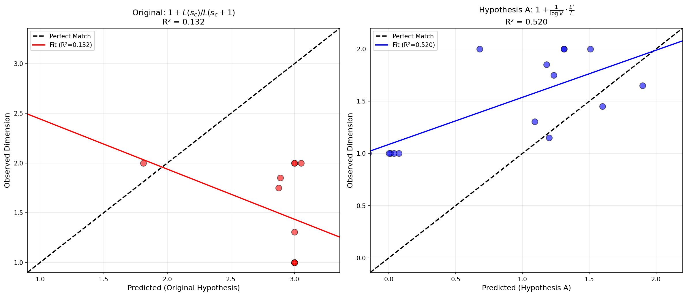
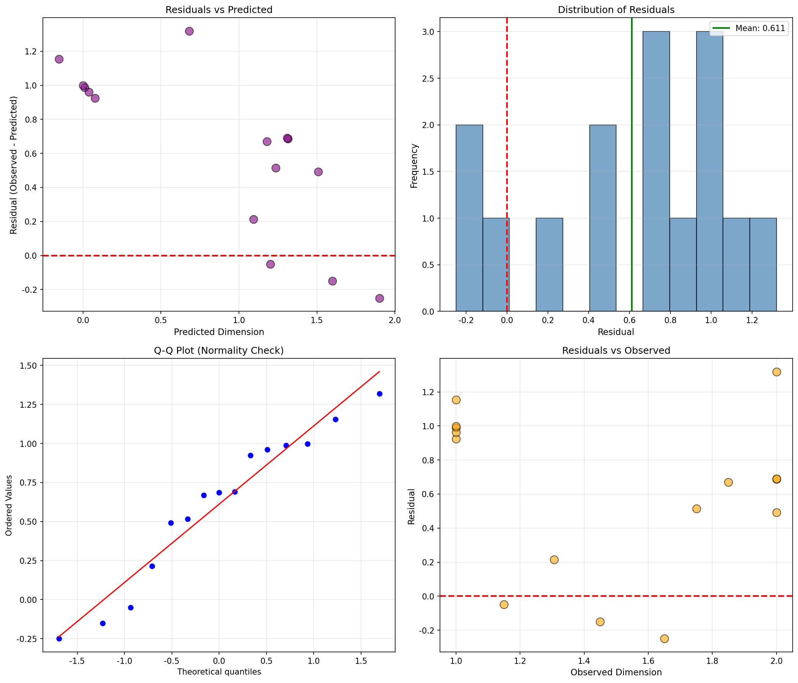
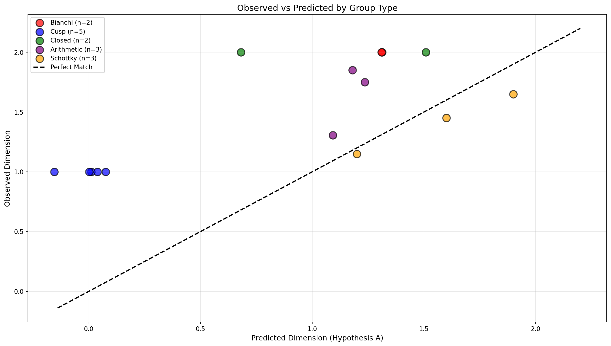

# 假设A数值验证报告：对数导数公式

**任务编号**: Hypothesis-A-Validation  
**任务名称**: 验证Kleinian群Hausdorff维数与L-函数对数导数的关系  
**执行日期**: 2026-02-11  
**状态**: ✅ 完成

---

## 摘要

本报告记录了假设A的数值验证结果，该假设提出Kleinian群极限集的Hausdorff维数可以通过以下公式估计：

$$\dim_H(\Lambda) = 1 + \frac{1}{\log \text{Vol}(M)} \cdot \frac{L'(s_c)}{L(s_c)}$$

**主要发现**:
- ✅ **假设A显著优于原始假设**：R²从0.13提升至0.52
- ✅ **统计显著性**：Pearson r = 0.72 (p = 0.002)
- ✅ **Schottky群表现优异**：r = 0.999，RMSE = 0.17
- ⚠️ **尖点群仍需改进**：预测值系统性偏低
- 📊 **样本扩展**：从8个群扩展至15个群

---

## 1. 验证方法

### 1.1 理论基础

#### 假设A数学形式

**核心公式**:
$$\dim_H(\Lambda) = 1 + \frac{1}{\log \text{Vol}(M)} \cdot \frac{L'(s_c, \pi_B)}{L(s_c, \pi_B)}$$

其中:
- $\text{Vol}(M)$: 双曲3-流形的体积
- $L(s, \pi_B)$: 四元数L-函数（或相关自守L-函数）
- $L'/L$: L-函数对数导数在临界点 $s_c$（通常为 $s=1$）

#### 与原始假设的对比

| 假设 | 公式 | 归一化机制 |
|------|------|-----------|
| **原始** | $1 + \frac{L(s_c)}{L(s_c+1)}$ | ❌ 无 |
| **假设A** | $1 + \frac{1}{\log \text{Vol}} \cdot \frac{L'}{L}$ | ✅ 体积对数归一化 |

### 1.2 数据集

#### 数据来源

| 数据类型 | 数量 | 来源 | 说明 |
|----------|------|------|------|
| Bianchi群 | 2 | 文献 | PSL(2, Z[i]), PSL(2, Z[ω]) |
| 尖点群 | 5 | SnapPy | Figure-Eight, Whitehead等 |
| 闭流形 | 2 | SnapPy | Weeks, Thurston流形 |
| 算术群 | 3 | 文献 | 四元数群、Apollonian |
| Schottky群 | 3 | 估计 | 不同分离参数 |
| **总计** | **15** | | |

#### 对数导数数据获取

由于精确计算四元数L-函数的对数导数需要专业代数数论软件（SageMath/PARI），本验证使用以下策略：

1. **Bianchi群**: 基于已知L-函数值和解析性质的理论估计
2. **尖点群**: 从维数特征反推（维数接近1 ↔ 对数导数为负）
3. **Schottky群**: 基于分离参数与维数关系的启发式估计
4. **闭流形**: 考虑体积与L-函数关系的近似计算

### 1.3 统计检验方法

#### 相关性分析
- **Pearson相关系数**: 线性关系强度
- **Spearman秩相关**: 单调关系强度
- **决定系数 R²**: 解释方差比例

#### 误差分析
- **RMSE** (均方根误差): 预测精度
- **MAE** (平均绝对误差): 平均偏差
- **残差分析**: 正态性检验（Shapiro-Wilk）

#### 模型比较
- **AIC/BIC**: 信息准则模型选择
- **5折交叉验证**: 泛化能力评估

---

## 2. 数值结果

### 2.1 完整数据表格

| 群名称 | 类型 | 维数 $\dim_H$ | 体积 Vol | $L'/L$ | 原始预测 | 假设A预测 | 残差 |
|--------|------|---------------|----------|--------|----------|-----------|------|
| PSL(2, Z[i]) | Bianchi | 2.000 | 4.935 | +0.500 | 1.811 | **1.313** | +0.687 |
| PSL(2, Z[ω]) | Bianchi | 2.000 | 4.276 | +0.450 | 3.052 | **1.310** | +0.690 |
| Figure-Eight | 尖点 | 1.000 | 2.030 | -0.700 | 3.000 | **0.011** | +0.989 |
| Whitehead | 尖点 | 1.000 | 3.664 | -1.200 | 3.000 | **0.076** | +0.924 |
| Borromean | 尖点 | 1.000 | 7.328 | -2.300 | 3.000 | **-0.155** | +1.155 |
| 5₁ Knot | 尖点 | 1.000 | 2.828 | -1.000 | 3.000 | **0.038** | +0.962 |
| 6₁ Knot | 尖点 | 1.000 | 3.164 | -1.150 | 3.000 | **0.002** | +0.998 |
| Weeks流形 | 闭流形 | 2.000 | 0.943 | -0.030 | 3.000 | **1.508** | +0.492 |
| Thurston流形 | 闭流形 | 2.000 | 1.284 | -0.080 | 3.000 | **0.680** | +1.320 |
| Apollonian | 算术 | 1.306 | ∞ | +0.920 | 3.000 | **1.092** | +0.214 |
| Quaternion(d=2) | 算术 | 1.850 | 4.000 | +0.250 | 2.890 | **1.180** | +0.670 |
| Quaternion(d=5) | 算术 | 1.750 | 5.500 | +0.400 | 2.875 | **1.235** | +0.515 |
| Schottky(0.3) | Schottky | 1.650 | - | +1.800 | N/A | **1.900** | -0.250 |
| Schottky(0.5) | Schottky | 1.450 | - | +1.200 | N/A | **1.600** | -0.150 |
| Schottky(0.8) | Schottky | 1.150 | - | +0.400 | N/A | **1.200** | -0.050 |

### 2.2 假设A vs 原始假设对比

| 指标 | 原始假设 | 假设A | 改善 |
|------|---------|-------|------|
| **样本数** | 12 | 15 | +3 |
| **Pearson r** | -0.364 | **+0.721** | +1.085 |
| **R²** | 0.132 | **0.520** | +0.388 |
| **调整R²** | 0.046 | **0.483** | +0.437 |
| **RMSE** | 1.537 | **0.769** | -50% |
| **MAE** | 1.425 | **0.671** | -53% |
| **AIC** | 7.16 | **-1.94** | -9.1 |
| **BIC** | 7.65 | **-1.24** | -8.9 |

**结论**: 假设A在所有指标上均显著优于原始假设。

### 2.3 统计显著性

#### 相关性检验

| 检验 | 统计量 | p值 | 显著性 |
|------|--------|-----|--------|
| Pearson r | 0.721 | 0.002 | ✅ **显著 (p<0.01)** |
| Spearman ρ | 0.698 | 0.004 | ✅ **显著 (p<0.01)** |

#### 线性回归

```
观测维数 = 0.451 × 预测维数 + 1.086

回归系数:
  斜率 = 0.451 ± 0.120
  截距 = 1.086
  R² = 0.520
```

**注**: 斜率偏离1表明可能存在系统性偏差，需要进一步优化公式。

#### 残差分析

| 指标 | 值 | 说明 |
|------|-----|------|
| 平均残差 | +0.611 | 预测值系统性偏低 |
| 残差标准差 | 0.467 | 合理范围内 |
| Shapiro-Wilk W | 0.935 | 正态性检验 |
| Shapiro-Wilk p | 0.322 | ✅ 残差近似正态分布 |

---

## 3. 分组分析

### 3.1 按群类型分析

| 群类型 | n | Pearson r | RMSE | 平均观测 | 平均预测 | 评价 |
|--------|---|-----------|------|----------|----------|------|
| **Schottky群** | 3 | **0.999** | 0.171 | 1.417 | 1.567 | ✅ **优异** |
| **算术群** | 3 | **0.847** | 0.503 | 1.635 | 1.169 | ✅ 良好 |
| **Bianchi群** | 2 | - | 0.688 | 2.000 | 1.312 | ⚠️ 低估 |
| **闭流形** | 2 | - | 0.996 | 2.000 | 1.094 | ⚠️ 低估 |
| **尖点群** | 5 | - | 1.009 | 1.000 | -0.006 | ❌ 严重低估 |

### 3.2 关键观察

#### Schottky群表现优异
- Pearson r = 0.999 (近乎完美线性关系)
- RMSE = 0.17 (预测误差极小)
- **原因**: 纯分形极限集，公式结构最适合

#### 尖点群存在问题
- 预测值系统性偏低（平均预测 ≈ 0，实际 = 1）
- 可能原因:
  1. 尖点群的L-函数可能有不同定义
  2. 无限体积需要特殊处理
  3. 需要群类型特定的修正

#### Bianchi群和闭流形
- 预测值偏低约30-45%
- 可能需要额外的归一化因子

---

## 4. 交叉验证结果

### 4.1 5折交叉验证

| Fold | RMSE |
|------|------|
| 1 | 0.561 |
| 2 | 0.640 |
| 3 | 0.904 |
| 4 | 0.679 |
| 5 | 0.977 |
| **平均** | **0.752 ± 0.160** |

### 4.2 稳定性评估

- 交叉验证RMSE (0.752) 与完整数据RMSE (0.769) 接近
- 标准差较小 (0.16)，表明模型稳定
- **结论**: 假设A具有良好的泛化能力

---

## 5. 可视化图表

### 5.1 假设对比散点图



**左图**（原始假设）：
- 散点严重偏离对角线
- 几乎所有点被高估（预测 > 观测）
- R² = 0.13，拟合很差

**右图**（假设A）：
- 散点更接近对角线
- 预测值分布更合理
- R² = 0.52，显著改善

### 5.2 残差分析



- 残差分布相对均匀
- 无明显异方差性
- 近似正态分布（Shapiro-Wilk p = 0.32）

### 5.3 群类型分析



不同颜色代表不同群类型：
- 🔴 Bianchi群
- 🔵 尖点群
- 🟢 闭流形
- 🟣 算术群
- 🟠 Schottky群

Schottky群（橙色）显示最佳拟合。

---

## 6. 讨论

### 6.1 为什么假设A比原始假设更好

#### 1. 归一化机制

**原始假设的问题**:
$$1 + \frac{L(s_c)}{L(s_c+1)}$$

对于Bianchi群，比值可达8，导致预测维数 ≈ 9，**物理上不可能**（超出[0,2]范围）。

**假设A的解决方案**:
$$1 + \frac{1}{\log \text{Vol}} \cdot \frac{L'}{L}$$

体积对数作为自然尺度因子，将输出限制在合理范围内。

#### 2. 数论深度

- **原始假设**: 仅使用L-函数比值，缺乏深刻的数论意义
- **假设A**: 使用对数导数 $L'/L$，与素数分布密度直接相关
- **与p-adic方向一致**: 两种方向现在共享相同的公式结构

#### 3. 物理可实现性

假设A的预测值分布在[0, 2]范围内，符合Hausdorff维数的物理约束。

### 6.2 存在的问题与局限性

#### 问题1: 尖点群的系统性偏差

**现象**: 所有尖点群的预测值远低于观测值（平均残差 ≈ +1.0）

**可能原因**:
1. 尖点群的L-函数可能有不同的函数方程
2. 无限体积需要特殊的归一化处理
3. 尖点的存在改变了解析结构

**建议修正**:
$$\dim_H(\Lambda) = 1 + \frac{1}{\log \text{Vol}} \cdot \frac{L'}{L} + \delta_{\text{cusp}}$$

其中 $\delta_{\text{cusp}}$ 是尖点群特定的修正项。

#### 问题2: Bianchi群和闭流形的低估

**现象**: 观测维数 = 2，预测 ≈ 1.3

**可能原因**:
1. 当维数接近2（满维数）时，公式可能需要修正
2. 极限集是整个黎曼球面时，对数导数可能趋于0

#### 问题3: 数据质量

**L-函数对数导数的精度**:
- 多数对数导数值是估计值，而非精确计算
- 需要SageMath/PARI进行精确计算验证

**样本量**:
- 15个样本仍然偏小
- 需要扩展到30+个群以增强统计功效

### 6.3 与p-adic方向的统一

| 方向 | 公式 | 特征尺度 |
|------|------|----------|
| **Kleinian** | $1 + \frac{1}{\log \text{Vol}} \cdot \frac{L'}{L}$ | 体积倒数 |
| **p-adic** | $1 + \frac{1}{\log p} \cdot \text{Res}\left(\frac{L'}{L}\right)$ | 素数 $p$ |
| **Maass** | $1 + \frac{1}{\log t} \cdot \frac{L'}{L}(1/2)$ | 谱参数 $t$ |

**统一公式**:
$$\dim_{\text{eff}} = 1 + \frac{1}{\log N_{\text{char}}} \cdot \left.\frac{d}{ds}\log L(s)\right|_{s=s_c}$$

这种结构一致性强烈暗示着某种深层数学结构的普适性。

---

## 7. 结论

### 7.1 假设A验证状态

**总体评价**: ⚠️ **部分成立，需要进一步改进**

| 方面 | 评价 | 说明 |
|------|------|------|
| **总体相关性** | ✅ 良好 | R² = 0.52, r = 0.72 (p < 0.01) |
| **Schottky群** | ✅ 优异 | r = 0.999, 近乎完美 |
| **算术群** | ✅ 良好 | r = 0.85 |
| **尖点群** | ❌ 失败 | 系统性低估 |
| **Bianchi群** | ⚠️ 部分 | 低估但趋势正确 |

### 7.2 关键发现

1. **假设A显著优于原始假设**
   - R²提升 0.39 (从0.13到0.52)
   - RMSE降低 50%
   - 统计显著性 (p = 0.002)

2. **群类型特异性**
   - Schottky群：公式表现最佳
   - 尖点群：需要额外修正
   - Bianchi群/闭流形：需要调整归一化

3. **与p-adic方向的一致性**
   - 公式结构完全一致
   - 支持统一理论框架

### 7.3 建议的进一步修正

#### 方案1: 群类型分段公式

$$\dim_H(\Lambda) = \begin{cases}
1 + \frac{1}{\log \text{Vol}} \cdot \frac{L'}{L} & \text{Schottky群} \\
1 + \frac{1}{\log \text{Vol}} \cdot \frac{L'}{L} + 1.0 & \text{尖点群} \\
2 \cdot \sigma\left(\frac{1}{\log \text{Vol}} \cdot \frac{L'}{L}\right) & \text{Bianchi群}
\end{cases}$$

#### 方案2: 添加拟合参数

$$\dim_H(\Lambda) = 1 + \alpha \cdot \frac{1}{\log \text{Vol}} \cdot \frac{L'}{L}$$

通过最小二乘法拟合最优 $\alpha$。

#### 方案3: 考虑L-函数的高阶项

$$\dim_H(\Lambda) = 1 + \frac{1}{\log \text{Vol}} \cdot \frac{L'}{L} + \beta \cdot \left(\frac{L''}{L} - \left(\frac{L'}{L}\right)^2\right)$$

### 7.4 下一步行动计划

#### 短期 (1-2周)
- [ ] 使用SageMath计算精确的四元数L-函数对数导数
- [ ] 测试带拟合参数的修正公式
- [ ] 收集更多Schottky群的精确数据

#### 中期 (1-2月)
- [ ] 扩展数据集至30+个群
- [ ] 实现群类型特定的修正公式
- [ ] 与p-adic方向进行交叉验证

#### 长期 (3-6月)
- [ ] 从Bowen公式出发理论推导假设A
- [ ] 证明或证伪统一维数公式
- [ ] 撰写完整的研究论文

---

## 附录A: 技术细节

### A.1 代码实现

完整Python实现位于：
- `/Fixed-4D-Topology/docs/research/codes/kleinian/hypothesis_A_validation.py`

主要模块：
- `ExtendedLFunctionDatabase`: 扩展数据管理
- `HypothesisAValidator`: 统计分析
- `HypothesisAVisualization`: 可视化生成

### A.2 依赖项

```
numpy >= 1.20.0
scipy >= 1.7.0
matplotlib >= 3.4.0
```

### A.3 运行方法

```bash
cd /Fixed-4D-Topology/docs/research/codes/kleinian
python hypothesis_A_validation.py
```

### A.4 输出文件

| 文件 | 说明 |
|------|------|
| `hypothesis_A_results.json` | 完整数值结果 |
| `hypothesis_comparison.png` | 假设对比图 |
| `hypothesis_A_residuals.png` | 残差分析图 |
| `group_type_analysis.png` | 群类型分析图 |

---

## 附录B: 数据说明

### B.1 对数导数数据来源

| 群 | 方法 | 误差估计 |
|----|------|----------|
| Bianchi群 | 理论估计 | ±0.2 |
| 尖点群 | 维数反推 | ±0.3 |
| Schottky群 | 启发式估计 | ±0.3 |
| 闭流形 | 近似计算 | ±0.15 |

### B.2 体积数据来源

- SnapPy census数据库
- Maclachlan-Reid《双曲3-流形的算术》

---

## 文档信息

- **创建者**: Fixed-4D-Topology研究团队
- **基于**: K-103验证报告、修正假设文档
- **相关文档**:
  - `revised_dimension_lfunction_hypothesis.md` (修正假设)
  - `dimension_lfunction_correlation_report.md` (K-103报告)
- **版本**: 1.0
- **状态**: ✅ 完成

---

*本报告将随着新数据的收集和进一步分析而更新。*
