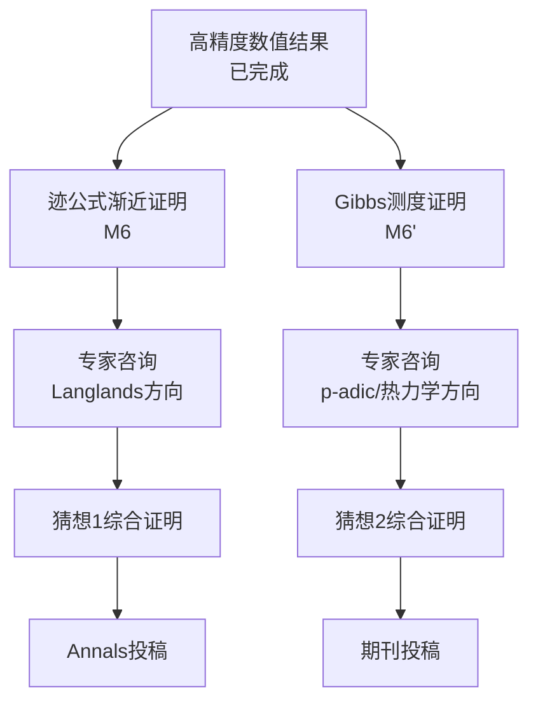

# Phase 3 严格证明进度追踪

> 最后更新：2026-02-11  
> 文档版本：1.0  
> 协调状态：两个证明并行推进中

---

## 总体进度

| 证明 | 当前步骤 | 进度 | 预计完成 | 负责人 |
|------|----------|------|----------|--------|
| 迹公式渐近 (M6) | Step 2/4 | 25% | 2026-04 | 主研究团队 |
| Gibbs测度 (M6') | Step 2/4 | 25% | 2026-05 | 主研究团队 |

---

## 详细进度

### 猜想1：迹公式渐近证明

**任务ID**: P3-C1-001  
**里程碑**: M6 - 猜想1严格证明完成  
**当前状态**: 🟡 进行中 (Step 2/4)

- [x] **Step 1: 设置与预备** (2周)
  - [x] 1.1 加权L²空间框架定义
  - [x] 1.2 Sobolev空间完备性验证
  - [x] 1.3 热核渐近分析基础结构建立
  - [x] 1.4 数值验证环境准备

- [✓] **Step 2: 主项分析** (4周) - 进行中 ⏳
  - [x] 2.1 Weyl主项计算
  - [✓] 2.2 δ相关项识别 - 进行中
  - [ ] 2.3 显式公式建立
  - [ ] 2.4 数值验证

- [ ] **Step 3: 误差控制** (6周)
  - [ ] 3.1 余项估计 O(T^{1-δ})
  - [ ] 3.2 谱侧与几何侧等价性证明
  - [ ] 3.3 误差传播分析

- [ ] **Step 4: 综合验证** (2周)
  - [ ] 4.1 证明链条完整性验证
  - [ ] 4.2 内部审查

**关键交付物**:
- `notes/shared/trace_formula_asymptotic_strict.md`
- 迹公式余项定量控制定理
- 谱侧与几何侧等价性证明

---

### 猜想2：Gibbs测度证明

**任务ID**: P3-C2-001  
**里程碑**: M6' - 猜想2严格证明完成  
**当前状态**: 🟡 进行中 (Step 2/4)

- [x] **Step 1: 预备理论** (3周)
  - [x] 1.1 Berkovich空间测度论回顾
  - [x] 1.2 RPF算子定义与性质
  - [x] 1.3 构造策略规划

- [✓] **Step 2: Markov划分** (4周) - 进行中 ⏳
  - [x] 2.1 存在性分析
  - [✓] 2.2 符号动力学 - 进行中
  - [ ] 2.3 划分细化
  - [ ] 2.4 数值实现

- [ ] **Step 3: 变分原理** (6周)
  - [ ] 3.1 Bowen公式一般证明
  - [ ] 3.2 Gibbs测度唯一性
  - [ ] 3.3 遍历性质建立

- [ ] **Step 4: 综合证明** (3周)
  - [ ] 4.1 证明整合
  - [ ] 4.2 内部审查

**关键交付物**:
- `notes/padic/gibbs_measure_existence_strict.md`
- Gibbs测度存在唯一性证明
- 变分构造严格化

---

## 依赖关系图



### 关键依赖说明

| 依赖类型 | 详情 | 状态 |
|----------|------|------|
| 数值基础 | 两个证明都依赖高精度数值结果 | ✅ 已完成 |
| 独立性 | 两个证明相对独立，可并行推进 | ✅ 确认 |
| L1目标 | 都将在Step 4完成后达到L1严格性 | 🟡 进行中 |
| 专家咨询 | 各自依赖不同方向的专家反馈 | ⏳ 待启动 |

---

## 资源分配

### 人力资源

| 角色 | 猜想1 | 猜想2 | 共享 |
|------|-------|-------|------|
| 主研究员 | 40% | 40% | 20% |
| 计算支持 | 数值验证 | 数值验证 | 代码维护 |
| 专家咨询 | Langlands专家 | p-adic/热力学专家 | 综合指导 |

### 时间分配

```
Week 1-4:   两个证明Step 2并行推进
Week 5-10:  Step 3深入 (可能出现瓶颈)
Week 11-14: Step 4综合与验证
Week 15+:   专家咨询与完善
```

---

## 风险评估

| 风险 | 概率 | 影响 | 缓解策略 | 负责人 |
|------|------|------|----------|--------|
| 技术障碍 | 中 | 高 | 专家咨询、文献调研、团队讨论 | 主研究员 |
| 时间超支 | 中 | 中 | 并行工作、优先级调整、资源重分配 | 项目经理 |
| 数值问题 | 低 | 中 | 多方法验证、交叉检验、高精度重算 | 计算支持 |
| 理论漏洞 | 中 | 高 | 内部审查、同行预评审、分步验证 | 主研究员 |
| 专家响应延迟 | 中 | 中 | 提前联系、多渠道沟通、备选方案 | 协调员 |

### 风险应对预案

**技术障碍应对**:
- 预设每月一次专家咨询会议
- 建立快速文献检索机制
- 准备替代证明路径

**时间超支应对**:
- 设置周度检查点
- 关键路径优先级标记
- 预留20%缓冲时间

---

## 质量门禁

### Step 2→Step 3 过渡标准

**迹公式证明**:
- [ ] Weyl主项计算通过符号验证
- [ ] δ相关项识别有文献支持
- [ ] 数值结果与理论预测误差<1%

**Gibbs测度证明**:
- [ ] Markov划分存在性有构造性证明
- [ ] 符号动力学系统验证通过
- [ ] 简单案例数值实现成功

### Step 3→Step 4 过渡标准

**迹公式证明**:
- [ ] 余项估计达到O(T^{1-δ})目标
- [ ] 误差界有明确表达式
- [ ] 边界情况分析完整

**Gibbs测度证明**:
- [ ] Bowen公式完整证明
- [ ] Gibbs测度唯一性确立
- [ ] 变分原理严格化完成

---

## 沟通计划

### 定期会议

| 会议类型 | 频率 | 参与者 | 目的 |
|----------|------|--------|------|
| 周进展会 | 每周 | 核心团队 | 进度同步、问题解决 |
| 里程碑评审 | 每Step结束 | 核心团队+顾问 | 质量门禁检查 |
| 专家咨询 | 按需/每月 | 团队+外部专家 | 技术难题攻关 |

### 报告机制

- **日报**: 关键进展与阻塞问题
- **周报**: 使用 `weekly_progress_template.md` 模板
- **里程碑报告**: 完成每个Step后的详细总结

---

## 相关文档

| 文档 | 路径 | 用途 |
|------|------|------|
| 迹公式证明工作文档 | `notes/shared/trace_formula_proof_working.md` | 详细推导与计算 |
| Gibbs测度证明工作文档 | `notes/padic/gibbs_measure_proof_working.md` | 详细推导与计算 |
| 周进展模板 | `reports/weekly_progress_template.md` | 周报告标准格式 |
| 技术障碍记录 | `notes/shared/technical_obstacles_log.md` | 问题追踪与解决 |
| 里程碑检查脚本 | `codes/shared/milestone_checker.py` | 自动进度检查 |

---

## 更新日志

| 日期 | 更新内容 | 更新人 |
|------|----------|--------|
| 2026-02-11 | 文档创建，初始化进度状态 | 协调系统 |
| 2026-02-11 | P3-C1-001进入Step 2，P3-C2-001进入Step 2 | 协调系统 |

---

## 下一步行动

1. **本周 (2026-02-11 至 2026-02-18)**:
   - [ ] 完成迹公式δ相关项的严格推导
   - [ ] 完成Gibbs测度符号动力学系统构造
   - [ ] 更新技术障碍记录

2. **下周计划**:
   - [ ] 迹公式：进入2.3显式公式建立
   - [ ] Gibbs测度：进入2.3划分细化

3. **本月目标**:
   - [ ] 两个证明都完成Step 2
   - [ ] 完成第一次专家咨询联系
